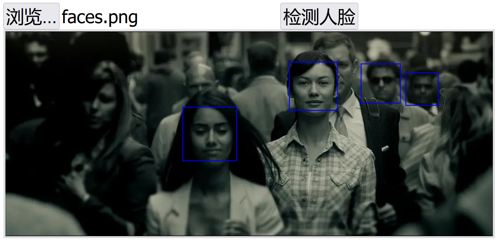

# rust-scf-facefinder
腾讯云函数SCF上的Rust人脸检测



```JavaScript
var data = {
    img: base64,
    min_size: 60,
    shift_factor: 0.1,
    threshold: 0.2
};

fetch(url,{
    method: 'POST',
    body: JSON.stringify(data),
    headers: getHeader()
}).then(res => {
    res.json().then(faces => {
        ctx.strokeStyle="blue";
        ctx.lineWidth = 2;
        faces.forEach(face => {
            ctx.strokeRect(face.rect.left, face.rect.top, face.rect.width, face.rect.height);
        });
    });
})
```

### *如何编译*

Windows环境下，需要在Linux子系统编译，编译脚本如下：

```PowerShell
## 在windows控制台输入bash，进入linux子系统
bash
```

```bash
## 静态链接编译
RUSTFLAGS='-C target-feature=+crt-static' cargo build --target=x86_64-unknown-linux-gnu --release
## 复制编译好的文件
cp target/x86_64-unknown-linux-gnu/release/scf-server pkg/bootstrap
cd pkg
## 给文件添加执行权限
chmod 755 ./bootstrap
## 打包zip
zip pkg.zip bootstrap
```

### *云函数上传和部署*

进入腾讯Serverless控制台的云函数管理，在函数代码中，选择“本地上传zip包”，上传并部署。